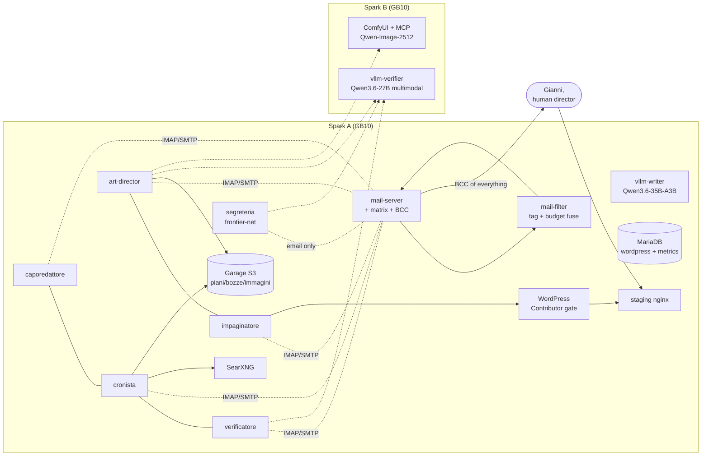

<!-- =============================================================================
  menabò — an experiment in human-agent newsroom integration
 ------------------------------------------------------------------------------
  File:     README.md
  Purpose:  Front door of the repository: the research question, the
            architecture, and how to run the experiment.
  Author:   Gianni Alessandroni
  Created:  2026-08-16
  License:  Apache-2.0 — see LICENSE
  Part of:  menabò https://github.com/GianniAlessandroni/menabo
============================================================================== -->

# menabò

*A "menabò" is the layout dummy of a magazine issue — the working skeleton the
real pages grow on.*

**menabò** is a multi-agent editorial newsroom that produces an online magazine
under the supervision of a human editor-in-chief. Six AI agents (running on the
[Hermes Agent](https://github.com/NousResearch/hermes-agent) runtime) coordinate
**only through the tools human teams use** — email, shared files, a CMS — never
through agent-native protocols.

## The research question

What does email-mediated coordination *cost* a team of AI agents? The
inefficiency is the object of study, so it is **measured, not optimized away**:
every message, bounce, forwarding hop, blown message budget, review cycle,
director intervention and token is recorded in a metrics database and
summarized weekly. Two articles a week is the target; slowness is acceptable,
loss of control is not.

## Binding principles (docs/SPEC.md §2)

1. **Nothing is published without the human director.** The layout agent's
   WordPress role is *Contributor*: it can draft, it cannot publish.
2. **Security is deterministic; coordination is not.** Who-may-mail-whom lives
   in Postfix restriction maps, not in prompts. Prompts can fail; bounces don't.
3. **Communication loops are observed, not prevented** — a hop-counting header
   and a per-article message budget (default 60) that freezes runaway threads.
4. **The segreteria is the trust boundary**: separate Docker network, email
   only, one read-only status file.
5. **AI transparency** and an absolute ban on generating images of real people.
6. **One container = one agent = one folder.**

## Architecture



## Quickstart

```bash
# node B (verifier + optional ComfyUI)
cd spark-b && cp .env.example .env && docker compose up -d
docker compose --profile comfyui up -d          # image generation, optional

# node A (everything else)
cd spark-a && cp .env.example .env              # fill in secrets first
docker compose up -d mail-server mail-filter mariadb wordpress searxng valkey garage staging vllm-writer
../scripts/setup-mailboxes.sh
../scripts/setup-storage.sh                     # prints per-agent S3 keys
../scripts/setup-wordpress.sh                   # prints the MCP basic-auth
# paste credentials into spark-a/agents/*/.env (from *.env.example)
docker compose up -d --build caporedattore cronista verificatore art-director impaginatore segreteria

# prove it works, end to end
../scripts/smoke-test.sh
```

Operations (start/stop, backup, disaster recovery, the weekly ritual) are in
**[docs/RUNBOOK.it.md](docs/RUNBOOK.it.md)** (Italian, for the newsroom).

## Repository map

| Path | What |
|---|---|
| `docs/SPEC.md` | The founding specification (Italian, immutable) |
| `CODING-STANDARDS.md` | Binding standards — read before writing any file |
| `docs/GLOSSARY.md` | The Italian domain vocabulary, explained |
| `spark-a/`, `spark-b/` | One compose file per node |
| `spark-a/mail-server/` | The normative heart: matrix, filter, budget fuse |
| `spark-a/agents/<name>/` | One folder per agent: `SOUL.md`, config, env |
| `metrics/` | Schema, nightly collector, quality-review CLI, report |
| `scripts/` | Setup, smoke test, backup, header check |
| `tests/` | pytest suite for filters and collectors |

## License

Apache-2.0 (see [LICENSE](LICENSE)). Third-party services run unmodified in
containers; their licenses are listed in
[docs/THIRD-PARTY.md](docs/THIRD-PARTY.md).
